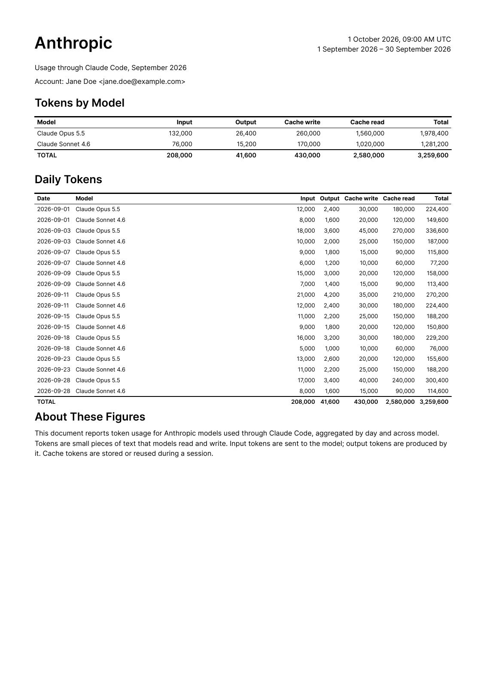

# AI usage

Make monthly PDF reports of token usage from Claude Code, Codex, OpenCode and pi logs.



Licensed under [MIT](LICENSE).

Requires Node.js 22 or newer, plus Python 3.9 or newer on every computer you
collect logs from.

```sh
npx @cynddl/ai-usage init      # generate ai-usage.toml in the current directory
npx @cynddl/ai-usage collect   # save usage logs in usage/
npx @cynddl/ai-usage report    # write PDFs in reports/
npx @cynddl/ai-usage           # both collect and report
```

To aggregate usage across multiple servers or virtual machines, use `ai-usage.toml`.
You can also set optional `account_name` and `account_email` fields.

This script uses [ccusage](https://github.com/ccusage/ccusage) for most of the heavy lifting, but also carefully collects logs from multiple sources such as remote machines and virtual machines. Adding additional providers should be simple and straightforward.

## Development

To run from source, you can for instance keep your config, logs and PDFs in a `.local/` directory:

```sh
mkdir -p .local
cd .local
node ../bin/ai-usage.mjs init
node ../bin/ai-usage.mjs
```

Run `pnpm test` for tests and `pnpm test:package` to check the package after
installation. The package test requires Poppler (`brew install poppler` on macOS,
or `sudo apt-get install poppler-utils` on Ubuntu/Debian).

Regenerate the README image with `pnpm exec node scripts/screenshot.mjs` (also
requires Poppler).
